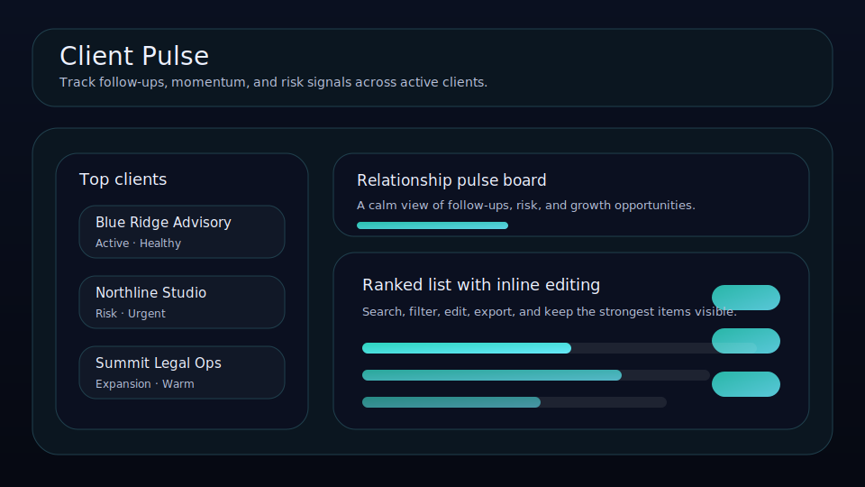

# Client Pulse

Track follow-ups, momentum, pipeline value, and risk signals across active clients.



Client Pulse is a local-first relationship board for solo operators, agencies, and productized service businesses that want a calmer way to manage client health. Instead of burying important accounts in a generic CRM, it keeps follow-up dates, relationship momentum, and account value visible in one compact workspace.

## What it does

- ranks client records by leverage, urgency, momentum, and value
- tracks **last touch** and **next touch** for every relationship
- shows overdue follow-ups and highest-risk accounts at a glance
- stores **contact name**, **tracked value**, and **relationship momentum** per client
- includes quick actions for logging a fresh touchpoint, nudging a follow-up, and restoring account health
- renders a follow-up queue and relationship snapshot beneath the main board
- saves locally in the browser with JSON import/export backups

## Why it feels different

Client Pulse is built for people who do not want a bloated CRM just to remember who needs attention next. It feels closer to a decision board than a database, which makes it much better for founders and consultants running a small but important client roster.

## Quick start

```bash
git clone https://github.com/get2salam/client-pulse.git
cd client-pulse
python -m http.server 8000
```

Then open <http://localhost:8000>.

## Keyboard shortcuts

- `N` creates a new client record
- `/` focuses the search box

## Data shape

```json
{
  "boardTitle": "Relationship pulse board",
  "items": [
    {
      "title": "Blue Ridge Advisory",
      "contact": "Elena Brooks",
      "category": "Active",
      "state": "Healthy",
      "score": 9,
      "momentum": 8,
      "value": 3200,
      "lastTouch": "2026-04-23",
      "nextTouch": "2026-04-29"
    }
  ]
}
```

## Privacy

Everything stays in your browser unless you export a JSON backup.

## License

MIT
